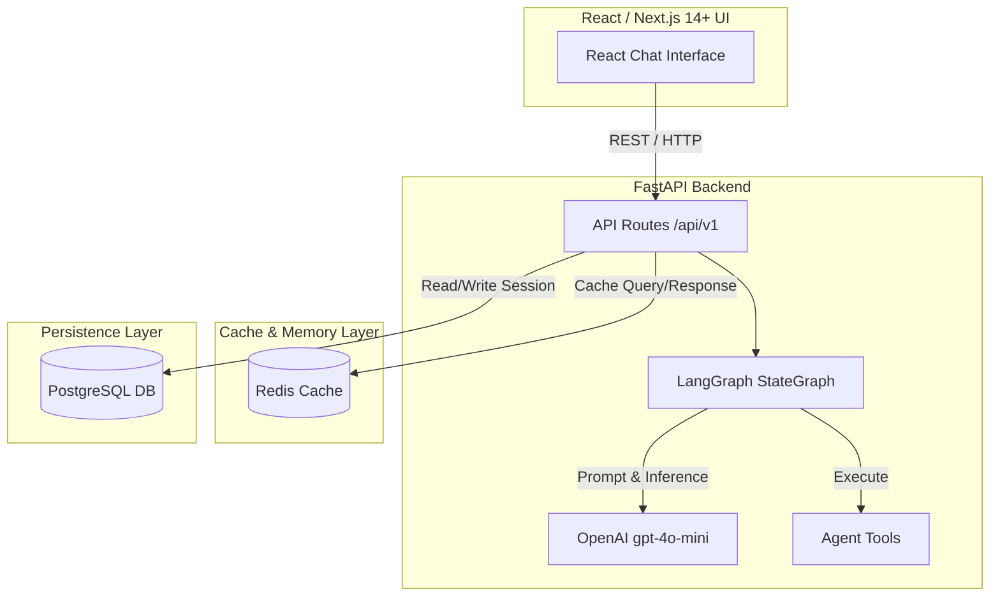

# Architecture Document (Project P-043)

## System Overview

Hệ thống AI Agent hiện đại kết hợp FastAPI backend, LangGraph cho quy trình suy luận của Agent, OpenAI `gpt-4o-mini` LLM, lưu trữ dữ liệu bền vững bằng PostgreSQL, bộ nhớ tạm & caching bằng Redis, và giao diện React / Next.js 14+ App Router.

## Architecture Diagram

## Components

### 1. Frontend (React / Next.js 14+)
- **Location:** `frontend/`
- **Tech:** Next.js 14+ App Router, React 18, Tailwind CSS, Lucide Icons
- **Key Features:** Sidebar chọn phiên hội thoại (sessions), màn hình chat thời gian thực, hiển thị trạng thái kết nối PostgreSQL & Redis.

### 2. Backend (FastAPI)
- **Location:** `src/main.py`, `src/api/routes.py`
- **Purpose:** Xử lý REST request, quản lý phiên chat, kết nối Database & Cache, kích hoạt LangGraph Agent.

### 3. AI Agent (LangGraph + OpenAI)
- **Location:** `src/agents/`
- **State Schema:** `AgentState` với `add_messages` reducer quản lý hội thoại.
- **Model:** `gpt-4o-mini` qua `ChatOpenAI`.

### 4. Database (PostgreSQL)
- **Location:** `src/db/`
- **ORM:** Async SQLAlchemy 2.0 (`postgresql+asyncpg`)
- **Tables:** `chat_sessions`, `chat_messages`

### 5. Cache & Memory Store (Redis)
- **Location:** `src/services/redis_service.py`
- **Purpose:** Caching câu trả lời của agent, lưu vết tạm thời và hỗ trợ rate limiting.

## Design Decisions

| Decision | Choice | Reason |
|----------|--------|--------|
| Framework | FastAPI 0.115+ | Async performance, Pydantic type safety |
| Agent Engine | LangGraph | State machine linh hoạt cho AI agent |
| LLM | OpenAI gpt-4o-mini | Chi phí tối ưu & tốc độ phản hồi nhanh |
| Primary Database | PostgreSQL | Bền vững, chuẩn production |
| Caching | Redis | Phản hồi siêu tốc cho queries lặp lại |
| Frontend | React / Next.js 14+ | Trải nghiệm người dùng tốt, dễ phát triển tiếp |
