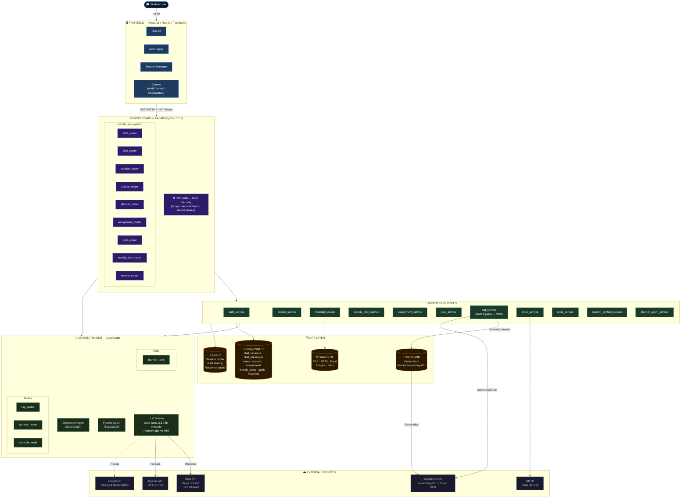
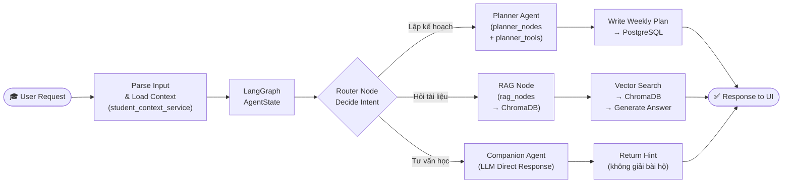
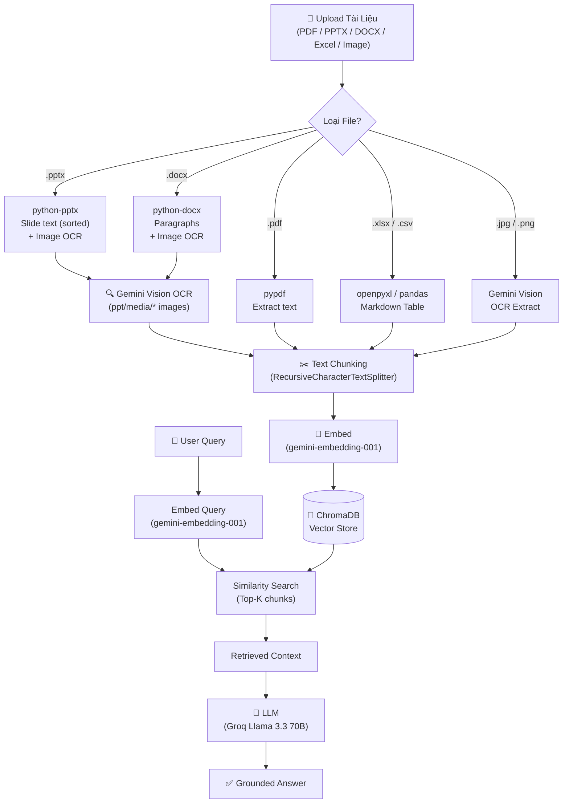

# 🏗️ Architecture Diagram — AI20K Learning Companion (P-043)

## System Overview

Hệ thống **AI20K Learning Companion** là một AI Agent platform hoàn chỉnh gồm 5 lớp:
**Frontend → Backend API → Business Services & AI Agent Engine → Data Layer**, kết nối với các **External Services** (Groq, Gemini, SMTP).

---

## 1. Full Component Diagram

---

## 2. Agent Execution Flow

---

## 3. RAG Pipeline Detail

---

## 4. Data Flow — Luồng dữ liệu chính

| # | Từ | Đến | Giao thức / Phương thức | Mô tả |
|---|----|----|------------------------|-------|
| 1 | **Student** | **Frontend** | HTTP | Giao diện React/Next.js nhận tương tác |
| 2 | **Frontend** | **FastAPI** | REST/HTTP + JWT Bearer | Xác thực mọi request |
| 3 | **FastAPI Routers** | **Services** | Function call | Định tuyến theo domain nghiệp vụ |
| 4 | **Services** | **Agent Engine** | Function call | Kích hoạt LangGraph StateGraph |
| 5 | **Agent** | **LLM Service** | API call | Gửi prompt, nhận inference |
| 6 | **LLM Service** | **Groq API** | HTTPS | Llama 3.3 70B (~300 tokens/s) |
| 7 | **LLM Service** | **OpenAI API** | HTTPS | GPT-4o-mini (fallback) |
| 8 | **rag_service** | **ChromaDB** | Local | Semantic vector search top-K |
| 9 | **rag_service** | **Gemini Vision** | HTTPS | OCR ảnh từ PPTX/DOCX/Image |
| 10 | **ChromaDB** | **Gemini Embedding** | HTTPS | Tạo vector embedding |
| 11 | **Services** | **PostgreSQL** | asyncpg | CRUD: sessions, messages, users, courses... |
| 12 | **Services** | **Redis** | TCP | Cache response, rate limiting |
| 13 | **material_service** | **MinIO / R2** | S3 API | Lưu/đọc file tài liệu |
| 14 | **email_service** | **SMTP** | SMTP/TLS | Gửi email xác nhận, reset password |
| 15 | **LangGraph** | **LangSmith** | HTTPS | Tracing & observability (tuỳ chọn) |

---

## 5. Components Summary

| Component | Technology | Phiên bản | File / Location |
|-----------|-----------|-----------|----------------|
| **Frontend** | React 18, Next.js, TypeScript, Tailwind | — | `frontend/` |
| **Backend Entry** | FastAPI, Uvicorn | ≥ 0.115 | `src/main.py` |
| **Config** | Pydantic Settings | ≥ 2.7 | `src/config.py` |
| **Auth** | JWT (bcrypt + HS256) | — | `src/core/security.py` |
| **Companion Agent** | LangGraph StateGraph | ≥ 0.2 | `src/agents/companion_agent.py` |
| **Planner Agent** | LangGraph StateGraph | ≥ 0.2 | `src/agents/planner_graph.py` |
| **RAG Nodes** | LangChain + ChromaDB | — | `src/agents/nodes/rag_nodes.py` |
| **Planner Nodes** | LangGraph Nodes | — | `src/agents/nodes/planner_nodes.py` |
| **Planner Tools** | LangChain `@tool` | — | `src/agents/tools/planner_tools.py` |
| **RAG Pipeline** | ChromaDB + Gemini Embedding + Vision | — | `src/services/rag_service.py` |
| **LLM Factory** | Groq / OpenAI / Gemini | — | `src/services/llm.py` |
| **Weekly Planner** | Business logic | — | `src/services/weekly_plan_service.py` |
| **PostgreSQL ORM** | Async SQLAlchemy 2.0 + asyncpg | ≥ 2.0 | `src/db/database.py` |
| **DB Migration** | Alembic | ≥ 1.13 | `alembic/` |
| **Redis Cache** | aioredis / redis-py | ≥ 5.0 | `src/services/redis_service.py` |
| **Vector Store** | ChromaDB (local persist) | ≥ 0.5 | `data/chroma/` |
| **File Storage** | boto3 (S3-compatible: MinIO / R2) | ≥ 1.34 | `src/services/storage/` |
| **Container** | Docker + docker-compose | v2.20+ | `Dockerfile`, `docker-compose.yml` |

---

## 6. Design Decisions

| Quyết định | Lựa chọn | Lý do |
|-----------|----------|-------|
| **Agent Framework** | LangGraph | StateGraph linh hoạt, hỗ trợ loop & branching |
| **Primary LLM** | Groq `llama-3.3-70b-versatile` | ~300 tokens/s, chi phí thấp, đủ mạnh cho tiếng Việt |
| **Embedding** | `gemini-embedding-001` | Độ chính xác cao hơn `text-embedding-004` (đã xác nhận fix lỗi 404) |
| **Vision OCR** | Gemini Vision API | Đọc được ảnh, sơ đồ, công thức LaTeX trong PPTX/DOCX |
| **Vector DB** | ChromaDB (local) | Không cần cloud, deploy đơn giản, phù hợp MVP |
| **Backend** | FastAPI 0.115+ | Async native, Pydantic type safety, auto Swagger docs |
| **Database** | PostgreSQL 16 | Bền vững, chuẩn production, hỗ trợ asyncpg |
| **Cache** | Redis 7 | Phản hồi tức thì cho queries lặp lại, rate limiting |
| **Storage** | MinIO / Cloudflare R2 | S3-compatible, dễ chuyển đổi môi trường |
| **Auth** | JWT HS256 + bcrypt | Stateless, secure, dễ scale |
| **ORM** | Async SQLAlchemy 2.0 | Native async, type-safe, tương thích Alembic |
| **Linter** | Ruff | Nhanh hơn flake8/black 10–100x |
